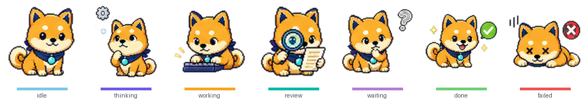
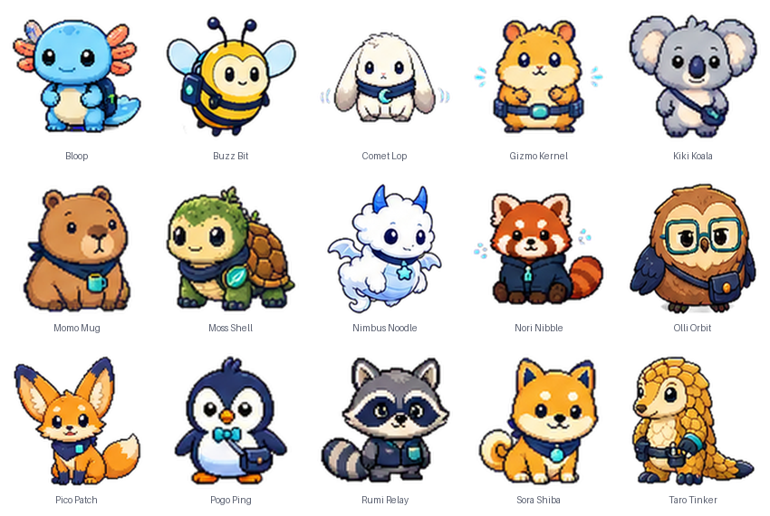

# workbuddy-buddy

A tiny desktop pet that shows your **WorkBuddy** agent's live status at a glance —
thinking, running a tool, waiting for you, done, or blocked. Inspired by the
Codex Pets ecosystem.




> **Not affiliated with, endorsed by, or connected to Tencent or WorkBuddy.**
> "WorkBuddy" is used only to describe compatibility.

---

## What it does

- **Glanceable status.** A hook on WorkBuddy's lifecycle drives the pet through 7
  states — `idle · thinking · working · review · waiting · done · failed` — so you
  can tell what your agent is doing without watching its window.
- **Progressive slacking animation.** After 15/25/35/60 minutes of inactivity,
  the bundled pets move from a fresh fish, to a salted fish, to a fish costume,
  and finally to one shared salted-fish form. Any activity resets the timer.
- **A library of 15 hand-drawn buddies, plus your own.** Switch anytime; drop a
  new one in without a rebuild.
- **The pet is a permission gate.** When WorkBuddy needs approval, the pet pops an
  **允许 / 拒绝** bubble and your click is fed back as the decision.
- **Click to summon.** Click the pet to bring WorkBuddy to the front; drag to move
  (its position is remembered across launches); right-click for the buddy picker.
- **Stays out of your way.** Only the pet's silhouette catches clicks — the
  transparent area around it is click-through, so the pet never blocks the window
  underneath. Toggle it from the tray.
- **Private by construction.** The WorkBuddy plugin projects a strict structural
  event whitelist locally. Office mounting sends only derived status, heartbeat,
  consent flags, and the selected bundled-pet ID — never prompts, replies, tool
  arguments, paths, messages, or email content.

## Quick start

Use the hosted Control Plane's `/start` page. It tries to open the installed
desktop pet and, if that fails, offers separate downloads for Apple Silicon and
Intel Macs. The desktop pet itself is not yet supported on Windows.

After a signed GitHub Release is published, the equivalent one-line installer is:

```sh
curl -fsSL https://raw.githubusercontent.com/FlashFamily/workbuddy-buddy/main/install.sh | bash
```

It detects the Mac architecture, verifies the release checksum and app signature,
installs into `~/Applications`, and launches the pet. It does not require Rust,
Python, or a source checkout.

<details>
<summary>Or step by step</summary>

```sh
git clone https://github.com/FlashFamily/workbuddy-buddy && cd workbuddy-buddy
cargo test                      # state logic
npm test --prefix integrations/workbuddy-plugin

# Run from source — pick one:
cargo run -p wb-buddy-bridge    # browser pet  → http://127.0.0.1:8787
cargo run -p wb-buddy-app       # native transparent floating window (macOS)
```
</details>

To build a proper local `.app`:

```sh
npx --yes @tauri-apps/cli@2.11.4 build --bundles app
codesign --force --deep --sign - target/release/bundle/macos/workbuddy-buddy.app
```

Public releases are built separately for ARM64 and x64, and the release workflow
refuses to publish without Apple signing and notarization credentials.

## Mount to an office (M2A preview)

The hosted Control Plane now has a clickable `/start` flow for creating your own
public office and pairing this Mac:

1. Open the Control Plane's `/start` page, choose the office name, buddy, and
   sharing options, then create a one-time pairing code.
2. Click **Open WorkBuddy Buddy**. The `workbuddy-buddy://connect#code=…` deep
   link opens the native panel and pre-fills the code, but never submits it.
3. Check the complete code and click **确认挂载** in the pet.
4. The app registers the formal `workbuddy-buddy@workbuddy-buddy` marketplace
   plugin while preserving existing WorkBuddy settings and creating a private
   backup. Restart WorkBuddy once when prompted.
5. Keep the browser page open while it checks the pairing status. After the app
   claims the code, the page takes you to your live office.

The app creates an Ed25519 device key during pairing. The private key stays in
the operating-system keychain; the Control Plane receives the public key and
uses it to verify signed state updates and heartbeats. To use a self-hosted or
local Control Plane, launch the app with
`WB_BUDDY_CONTROL_PLANE_URL=https://your-control-plane.example`.

This first preview creates an office owned by the person pairing the pet. Joining
someone else's office by invitation and Agent Mail identity verification are
follow-up milestones.

## Buddies



Open the picker from the **menu-bar tray → 选择伙伴**, by **right-clicking** the
pet (or **double-click** in the browser build). Your choice is remembered.

**Bring your own:** drop a pack into `~/.workbuddy-buddy/pets/<id>/` and it appears
in the picker instantly (tagged 自定义) — no rebuild. Full authoring guide:
**[docs/PET_SPEC.md](docs/PET_SPEC.md)**.

## Approval UI

When WorkBuddy is about to run a gated tool (default: `Bash`) or shows a permission
prompt, the pet asks **允许 / 拒绝**; your click is returned to WorkBuddy as a hook
decision (verified honored live). **Fail-open by design** — if the pet isn't
running or you don't answer in 50s, the hook stays silent and WorkBuddy behaves
exactly as if the pet weren't there.

## Privacy

The formal WorkBuddy plugin reads **event shape only** — event name, timestamp, session id, tool
*name*, permission mode, notification kind, and a computed "did the agent end on a
question?" flag. It **never** reads or stores prompt text, tool arguments, message
bodies, titles, email data, or transcript paths. The projection happens in
`integrations/workbuddy-plugin/scripts/status-runtime.mjs` before anything is
written; the local spool is private, symlink-safe, and size-capped. Office
mounting adds only signed derived status and heartbeat traffic. Enforced by the
dependency-free plugin tests.

## How it works

```
WorkBuddy  ──formal plugin──▶ status-hook.mjs ──▶ events.spool (structural-only)
(lifecycle)             (privacy projector)             │
                                          wb-buddy-watch  (robust spool tailer)
                                          wb-buddy-core   (7 core + 4 derived
                                            │              inactivity displays)
                                          display state
                                            ├─▶ wb-buddy-bridge → HTTP → browser pet
                                            └─▶ wb-buddy-app    → Tauri event → native pet
```

- **wb-buddy-core** — pure, content-free state derivation (no I/O; heavily tested).
- **wb-buddy-watch** — tails the spool; safe against partial lines and rotation.
- **wb-buddy-bridge** — serves the frontend + a `/state` endpoint (browser build).
- **src-tauri** — the desktop app: transparent window, tray, approval server, and
  the click-to-foreground shortcut.
- **frontend/** — canvas sprite renderer + the buddy library.

## Contributing

New buddies, code, and docs welcome — see **[CONTRIBUTING.md](CONTRIBUTING.md)**.

## License

[MIT](LICENSE). Buddy art is provided under the license in each pack's `pet.json`.
